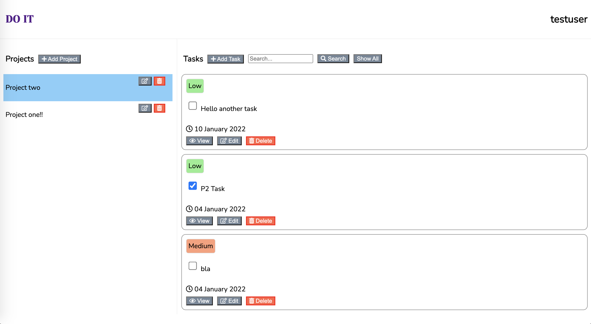

# README


| Name | Matric No. |
| ----------- | ----------- |
| Leong See Leng | A0239616X |

This is a Rails & React Task Management Application for the CVWO Assignment. It is hosted [here](https://cvwo-assignment-2022.herokuapp.com/) on Heroku.



Its features include:
- Basic CRUD on Tasks
- Labeling by Importance
- Organising into separate projects

| Name | Version |
| ----------- | ----------- |
| Ruby | 2.7.4 |
| Rails | 6.1.4.4 |

Try running...

```bash
bundle install
yarn install
rails db:create
rails db:migrate
rails db:seed
rails server
```

(hope it works)
